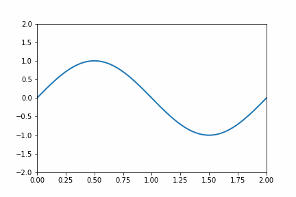

jawaban no 3

jawaban no 2

jawaban no 4

question 1
Apakah penjelasan kode dia atas sudah dibaca atau hadir pada kuliah?
#Answer1 sudah

question 2
Modifikasi program yang diberikan sehingga dapat menggambarkan gelombang yang merambat ke kanan dengan panjang gelombang λ = 2 m dan periode T = 2 s. Perolehlah pula berkas gif hasilnya.


#Answer2
```python
import numpy as np
from matplotlib import pyplot as plt
from matplotlib import animation

# First set up the figure, the axis, and the plot element we want to animate
fig = plt.figure()
ax = plt.axes(xlim=(0, 2), ylim=(-2, 2))
line, = ax.plot([], [], lw=2)

# initialization function: plot the background of each frame
def init():
    line.set_data([], [])
    return line,

# animation function.  This is called sequentially
def animate(i):
    x = np.linspace(0, 2, 1000)
    y = np.sin(np.pi * (x - 0.01 * i))
		
		# -----------------------
		
    line.set_data(x, y)
    return line,

# call the animator.  blit=True means only re-draw the parts that have changed.
anim = animation.FuncAnimation(fig, animate, init_func=init,
                               frames=200, interval=20, blit=True)

# save the animation as an mp4.  This requires ffmpeg or mencoder to be
# installed.  The extra_args ensure that the x264 codec is used, so that
# the video can be embedded in html5.  You may need to adjust this for
# your system: for more information, see
# http://matplotlib.sourceforge.net/api/animation_api.html
#anim.save('basic_animation.mp4', fps=30, extra_args=['-vcodec', 'libx264'])

#plt.show()


# lines above this line is the original code from Jake Vanderplas
# url https://jakevdp.github.io/downloads/code/basic_animation.py

# modification from Sparisoma Viridi 2022-03-29
option = 0

if option == 0:
	writergif = animation.PillowWriter(fps=30)
	anim.save('basic_animation.gif', writer=writergif)
# anim.save('basic_animation.mp4', fps=30, extra_args=['-vcodec', 'libx264'])
else:
	plt.show()

'''
gif



question 3
Modifikasi program yang diberikan sehingga dapat menggambarkan gelombang yang merambat ke kiri dengan panjang gelombang λ = 2 m dan periode T = 2 s. Perolehlah pula berkas gif hasilnya.


#answer3
```python
def init():
    line.set_data([], [])
    return line,

# animation function.  This is called sequentially
def animate(i):
    x = np.linspace(0, 2, 1000)
    y = np.sin(np.pi * (x + 0.01 * i))
		
		# -----------------------
		
    line.set_data(x, y)
    return line,

# call the animator.  blit=True means only re-draw the parts that have changed.
anim = animation.FuncAnimation(fig, animate, init_func=init,
                               frames=200, interval=20, blit=True)

# save the animation as an mp4.  This requires ffmpeg or mencoder to be
# installed.  The extra_args ensure that the x264 codec is used, so that
# the video can be embedded in html5.  You may need to adjust this for
# your system: for more information, see
# http://matplotlib.sourceforge.net/api/animation_api.html
#anim.save('basic_animation.mp4', fps=30, extra_args=['-vcodec', 'libx264'])

#plt.show()


# lines above this line is the original code from Jake Vanderplas
# url https://jakevdp.github.io/downloads/code/basic_animation.py

# modification from Sparisoma Viridi 2022-03-29
option = 0

if option == 0:
	writergif = animation.PillowWriter(fps=30)
	anim.save('basic_animation.gif', writer=writergif)
# anim.save('basic_animation.mp4', fps=30, extra_args=['-vcodec', 'libx264'])
else:
	plt.show()

'''
 
 gif
 
 

 
 question 4
 #answer4
 ```python
 def init():
    line.set_data([], [])
    return line,

# animation function.  This is called sequentially
def animate(i):
    x = np.linspace(0, 2, 1000)
    y = np.sin(np.pi * x) * np.cos(np.pi * 0.01 * i)
		
		# -----------------------
		
    line.set_data(x, y)
    return line,

# call the animator.  blit=True means only re-draw the parts that have changed.
anim = animation.FuncAnimation(fig, animate, init_func=init,
                               frames=200, interval=20, blit=True)

# save the animation as an mp4.  This requires ffmpeg or mencoder to be
# installed.  The extra_args ensure that the x264 codec is used, so that
# the video can be embedded in html5.  You may need to adjust this for
# your system: for more information, see
# http://matplotlib.sourceforge.net/api/animation_api.html
#anim.save('basic_animation.mp4', fps=30, extra_args=['-vcodec', 'libx264'])

#plt.show()


# lines above this line is the original code from Jake Vanderplas
# url https://jakevdp.github.io/downloads/code/basic_animation.py

# modification from Sparisoma Viridi 2022-03-29
option = 0

if option == 0:
	writergif = animation.PillowWriter(fps=30)
	anim.save('basic_animation.gif', writer=writergif)
# anim.save('basic_animation.mp4', fps=30, extra_args=['-vcodec', 'libx264'])
else:
	plt.show()
 
 '''
 
gif


